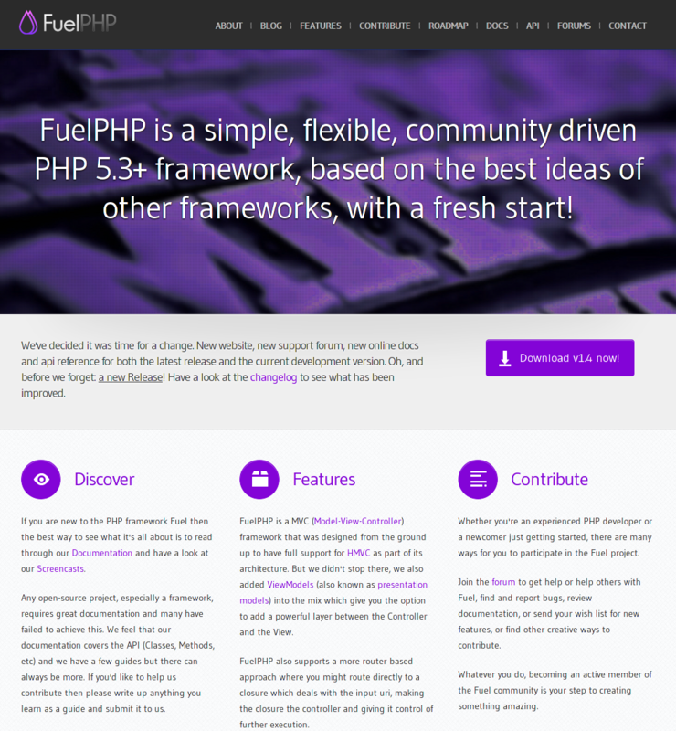
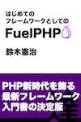

# [FuelPHPのこの1年](/Kenji_s/20121201/fuelphp_this_year)

[FuelPHP](/Kenji_s/searchdiary?word=%2A%5BFuelPHP%5D)

今日から25日間、[FuelPHP Advent Calendar 2012](http://atnd.org/events/33753)が開催されます。参加者が毎日、FuelPHPの記事を順に公開していきます。このイベントは去年も開催されており、今年で2年目になります。

本日初日ですが、みなさんに非常に残念なことをお知らせせねばなりません。

実は、今年の[アドベント](http://d.hatena.ne.jp/keyword/%A5%A2%A5%C9%A5%D9%A5%F3%A5%C8)([待降節](http://d.hatena.ne.jp/keyword/%C2%D4%B9%DF%C0%E1))は明日からです。ですので、今日はまだ本当はアドベントではありません。

とは言え、アドベントカレンダーは実際のアドベントとは無関係に12月1日から開始されるものが多いのも事実です。気を取り直して、粛々と進めたいと思います。

初日ですので、FuelPHPをあまりご存じない方にも、FuelPHPの概要や状況についてお知らせしていこうと思います。

\

## FuelPHPとは？

[http://fuelphp.com/](http://fuelphp.com/)

FuelPHPは、今もっとも注目されている最新のPHP[フレームワーク](http://d.hatena.ne.jp/keyword/%A5%D5%A5%EC%A1%BC%A5%E0%A5%EF%A1%BC%A5%AF)、オープンソース(MITライセンス)のWebアプリケーションフレームワークです。シンプルでフレキシブル、コミュニティにより開発されているPHP 5.3でゼロから書かれた最先端のPHPフレームワークです。2011年7月に最初の正式版バージョン1.0がリリースされました。

名前空間などを使っているため、動作にはPHP 5.3以上が必要ですのでご注意ください。開発した後に本番環境がPHP 5.2だったりすると悲惨なことになります。

FuelPHPのコア開発者は全員がCodeIgniterに関わっており、FuelPHPはCodeIgniterとテイストが非常に似ています。CodeIgniterと同じく軽量高速で習得しやすく高い拡張性と柔軟性を持ったフレームワークになっています。また、ゼロからPHP 5.3で書き直されているためコードもクリーンです。ライセンスも扱いやすい有名なオープンソースライセンスであるMITライセンスです。

なお、PHP 5.3でゼロから書き直されているためFuelPHPはCodeIgniterのフォークではありません。念のため。

まとめると、FuelPHPは、

-   もっとも注目されている
-   最先端
-   オープンソース
-   軽量高速
-   習得が容易

なPHPフレームワークということになります。

## FuelPHPの歴史

リリースの歴史は次のようになっています。

  日付         出来事
  ------------ -----------------------------
  2010/10      開発開始
  2011/01/08   FuelPHP 1.0.0-BETA1リリース
  2011/07/30   FuelPHP 1.0リリース
  2011/12/13   FuelPHP 1.1リリース
  2012/06/03   FuelPHP 1.2リリース
  2012/09/09   FuelPHP 1.3リリース
  2012/11/09   FuelPHP 1.4リリース

## FuelPHPのこの1年

この1年ほどの出来事をまとめると次のようになります。

  日付         場所   出来事
  ------------ ------ ---------------------------------------------------------------------
  2011/11/10   日本   FuelPHPドキュメント翻訳の開始
  2011/12/01   日本   「FuelPHP Advent Calendar 2011」開始
  2011/12/13   本家   FuelPHP 1.1リリース
  2011/12/27   日本   「FuelPHPまとめWiki」開始
  2012/01/10   日本   「fuelphp.jp Googleグループ」開始
  2012/03/22   日本   電子書籍『FuelPHP Advent Calendar 2011』(技術評論社)出版
  2012/06/02   日本   書籍『FuelPHP入門』(ソーテック社)出版
  2012/06/03   本家   FuelPHP 1.2リリース
  2012/06/07   日本   FuelPHP 勉強会 大須 vol.1
  2012/07/02   日本   電子書籍『はじめてのフレームワークとしてのFuelPHP』(達人出版会)出版
  2012/07/08   日本   FuelPHP 勉強会 東京 vol.1
  2012/07/22   日本   FuelPHP 勉強会 大須 vol.2
  2012/08/18   日本   「FuelPHP日本語ニュース」始動
  2012/09/09   本家   FuelPHP 1.3リリース
  2012/09/15   日本   PHPカンファレンス2012
  2012/09/23   日本   FuelPHP 勉強会 東京 vol.2
  2012/10/10   日本   FuelPHP 勉強会 大阪 vol.3
  2012/10/12   日本   「fuelphp.jp Googleグループ」200人突破
  2012/11/09   本家   FuelPHP 1.4リリース

それでは、主な出来事を振り返っていきたいと思います。

## FuelPHPドキュメント翻訳の開始

去年の11月に[@NEKOGET](http://twitter.com/NEKOGET)さんが公式ドキュメントの翻訳プロジェクトをGitHubで開始しました。これが日本でのFuelPHPに関する公の活動の始まりだったのではないかと思います。

-   [https://github.com/NEKOGET/FuelPHP\_docs\_jp/](https://github.com/NEKOGET/FuelPHP_docs_jp/)

翻訳プロジェクトは今も続いていますが、残念ながらあまり活発ではなく、いまだに全ドキュメントの翻訳が完了したバージョンはありません。ただし、基礎となる部分はほぼ完了しています。

「翻訳を俺が進めてやるぜ！」という方がいましたら、是非、上記のGitHubのリポジトリをご覧ください。

## FuelPHP Advent Calendar 2011

日本でFuelPHPに関する最初のイベントは、去年のアドベントカレンダーです。ユーザ数も少なく情報もほとんどない状態で人が集まるかどうかまったくわかりませんでしたが、[@ounziw](http://twitter.com/ounziw)さんにより開催されました。

-   FuelPHP Advent Calendar 2011 [http://atnd.org/events/22380](http://atnd.org/events/22380)

結果は13人しか集まらず、1人が何回か書くことになりましたが、無事終了できました。期間中にFuelPHP 1.1がリリースされました。

それに対して、今年のアドベントカレンダーは、11月中に25人の参加者がすべて埋まりました。1年で何という違いでしょう！

## fuelphp.jp Googleグループ

年が開けて[@NEKOGET](http://twitter.com/NEKOGET)さんにより日本語でFuelPHPの情報交換をするための「fuelphp.jp Googleグループ」が作成されました。

-   fuelphp.jp Googleグループ [https://groups.google.com/forum/?fromgroups\#!forum/fuelphp\_jp](https://groups.google.com/forum/?fromgroups#!forum/fuelphp_jp)

現在は、250名ほどが参加するまでに成長し、FuelPHPに関する日本語での最大のコミュニティになっています。FuelPHPユーザの方は、是非、ご参加下さい。

## 関連書籍

3月には、アドベントカレンダーの記事がまとめられた電子書籍『FuelPHP Advent Calendar 2011』が技術評論社より出版されました。たぶん、FuelPHPに関する世界で初めての書籍です。

この電子書籍は、以下のサイトより、ユーザ登録するだけで無料で入手できます。

-   『FuelPHP Advent Calendar 2011』 [https://gihyo.jp/dp/sp/advent2011/G11C13](https://gihyo.jp/dp/sp/advent2011/G11C13)

そして、6月には『FuelPHP入門』がソーテック社から出版されました。FuelPHPに関する日本で(たぶん世界でも)初めての紙の書籍です。

[FuelPHP入門](http://www.amazon.co.jp/dp/4881669419/?tag=hatena_st1-22&ascsubtag=d-43sw2)

-   作者: [早川聖司](http://d.hatena.ne.jp/keyword/%C1%E1%C0%EE%C0%BB%BB%CA)
-   出版社/メーカー: [ソーテック社](http://d.hatena.ne.jp/keyword/%A5%BD%A1%BC%A5%C6%A5%C3%A5%AF%BC%D2)
-   発売日: 2012/06/02
-   メディア: 単行本
-   購入: 7人 クリック: 134回
-   [この商品を含むブログ (6件) を見る](http://d.hatena.ne.jp/asin/4881669419)

-   『FuelPHP入門』 [http://www.sotechsha.co.jp/pc/html/941.htm](http://www.sotechsha.co.jp/pc/html/941.htm)

7月には、私が執筆した電子書籍『はじめてのフレームワークとしてのFuelPHP』が達人出版会から出版されました。

[はじめてのフレームワークとしてのFuelPHP【電子書籍】](http://tatsu-zine.com/books/fuelphp1st)

鈴木憲治\
達人出版会\
発行日: 2012-07-02\
対応フォーマット: EPUB, PDF\

[詳細を見る](http://tatsu-zine.com/books/fuelphp1st)

-   『はじめてのフレームワークとしてのFuelPHP』 [http://tatsu-zine.com/books/fuelphp1st](http://tatsu-zine.com/books/fuelphp1st)

この電子書籍はFuelPHP 1.2に完全に対応してリリースしました。

## FuelPHP勉強会

6月、7月に相次いでFuelPHP勉強会がスタートしています。[@ounziw](http://twitter.com/ounziw)さんにより名古屋大須での勉強会が、[@mukaken](http://twitter.com/mukaken)さんにより東京での勉強会がスタートしました。

-   FuelPHP 勉強会 大須 vol.1 [http://atnd.org/events/29536](http://atnd.org/events/29536)
-   FuelPHP 勉強会 東京 vol.1 [http://atnd.org/event/fuelphp](http://atnd.org/event/fuelphp)

10月には今まで地下に潜っていた[@omoon](http://twitter.com/omoon)さんによる「FuelPHP 勉強会 大阪」も公になりました。

-   FuelPHP 勉強会 大阪 vol.3 [http://atnd.org/events/32493](http://atnd.org/events/32493)

これらは、継続的なFuelPHPの勉強会です。東京はもともと人口が多いこともありますが、初回勉強会から50人規模で行われており、いきなり大きな規模の勉強会になっています。

今後も勉強会は開催されますので、興味のある方は参加したり、スタッフをしたり主催してみてください。勉強会の情報は、fuelphp.jp Googleグループに流れるでしょうし、FuelPHPまとめWikiにも記載されるでしょう。

-   [FuelPHP の勉強会・イベント : FuelPHP まとめ Wiki](http://wiki.fuelphp1st.com/wiki/index/FuelPHP%20%E3%81%AE%E5%8B%89%E5%BC%B7%E4%BC%9A%E3%83%BB%E3%82%A4%E3%83%99%E3%83%B3%E3%83%88)

## PHPカンファレンス2012

9月には毎年、東京でPHPカンファレンスが行われますが、今年、もっとも存在感のあったフレームワークがFuelPHPでした。去年は全く名前を目にすることがありませんでしたが、今年は多くのセッションでその名前を耳にしました。

各フレームワークの最新情報を届けるセッションである「フレームワークアップデート」にも初めて登場しました。その他、興味のある方は、次の記事をご覧ください。

-   [PHPカンファレンス2012でのFuelPHP](http://d.hatena.ne.jp/Kenji_s/20120917/fuelphp_at_php_con_2012)

## 日本語情報の爆発的な増加

1年前と比べると、書籍なども出ていますが、Web上の日本語情報も比較にならないほど増えました。「FuelPHP日本語ニュース」を見てもらえばわかりますが、今はほぼ毎日のように数本のブログ記事が書かれています。

-   FuelPHP日本語ニュース [https://www.facebook.com/jp.fuel](https://www.facebook.com/jp.fuel)

あまりに日本語情報が多いので、FuelPHPが日本製だと勘違いする人まで出てきたほどです。とはいえ、CakePHPなどの歴史のあるフレームワークと比べるとまだまだ情報は少ないですが。

## Web検索の人気度

Googleトレンドのによるここ1年の日本での検索ボリュームの推移です。

[Google トレンド](http://www.google.com/trends/explore?hl=ja#q=symfony%2C%20codeigniter%2C%20yii%2C%20zend%20framework%2C%20fuelphp&geo=JP&date=12%2F2011%2012m&cmpt=q)

ここ1年で、Symfony、CodeIgniterと肩を並べるレベルまで上昇していることがわかります。

なお、CakePHPははるか上に位置しており、含めるとグラフが見づらくなるため除外しています。決して、CakePHPをわざと無視しているわけではありません。

## FuelPHPをさらに知るには？

ほとんど全く技術的なことは書いていませんが、もし、FuelPHPに興味を持っていただけましたら、「FuelPHPまとめWiki」にFuelPHPの情報をまとめていますので、ここをスターティングポイントにすることでFuelPHPの様々な情報を得ることができると思います。

-   FuelPHPまとめWiki [http://wiki.fuelphp1st.com/wiki/](http://wiki.fuelphp1st.com/wiki/)

また、明日からはもっと、FuelPHPの技術的な話が続くと思いますのでご期待ください。

明日は、[@madmamor](http://twitter.com/madmamor)さんの「FuelPHPで画像をプログラムから出力する方法。切り取る方法。応用する方法。」です。お楽しみに！

