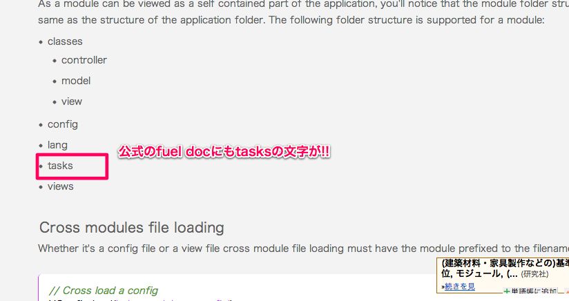

FuelPHP を使ったモジュール開発入門 @mikakane_info
===================================

[FuelPHPアドベントカレンダー企画](http://atnd.org/events/33753)です。

 昨日は[＠madmamor](http://madroom-project.blogspot.jp/2012/12/fac20121202.html)さんの「FuelPHPで画像をプログラムから出力する方法。切り取る方法。応用する方法。」でした。

3回めの私の方では、FuelPHPのモジュール開発機能について少々。

FuelPHPのmodule機能について
----------------------------

FuelPHPにはモジュールと言う機能がありまして、これが中々優秀なやつです。ざっくり簡単に説明するとMVCの塊をドンっと一つのディレクトリ以下にまとめて配置できるって機能です。アプリケーションを開発する上で、「あーこの機能別のアプリでも使えそうだなぁ」みたいな部分はモジュールとして分離して管理すると、別のアプリでもその部分流用するのが簡単って感じですね。1ディレクトリにまとめる事ができるので配布も楽ちんです。

moduleのtasks対応
-----------------

なんで今回、moduleを紹介しようかと思ったかというと、v1.3にてmoduleにtask対応が追加されたからです。

fuelの公式ドキュメントにも堂々と「tasks」の文字が追加されています。まぁmoduelの基本的な使い方は[公式ドキュメント](http://fuelphp.com/docs/general/modules.html)、や[私が以前書いたもの](http://mkkn.info/blog/blog/archives/1451.html)がありますのでそちらを見ていただけるといいと思います。

今回v1.3でのtasks対応で、単純なMVCとしてだけでなく、module管理ツールとしてのoilコマンドまで用意できるようになりmoduleの有用性が更に上がったように思います(というかもうpackageいらないんじゃない?)

module内でのtaskの使い方
------------------------

とはいえ、module内でtaskを使うのは微妙にややこしい所があるので少々解説を。基本的には公式ドキュメントの翻訳の域を出ませんが…。

まずtasksは他のクラス類と違って、`namespace Fuel\Tasks;`を使わなければなりません。他のクラス類が「モジュール名」の名前空間を強制されるのと比べて、大きく違う部分です(自分はまずここでつまりました…)。

moduleのtasksディレクトリ以下に`namespace Fuel\Tasks;`でtaskファイルを用意すれば、後は、

    php oil refine modulename::classname

みたいな感じでoilコマンド投げれば実行できます。接頭辞`modulename::`でモジュール内のファイルを探しに行くあたりはviewsファイルとかと同じ感じですね。

まとめ?
-------

個人的にphpでシェルスクリプトっていうのは、rubyでやれよ感がして凄く好きなので今回のtasks対応は非常に嬉しいところです。コンソール上でfuel的なオートロードを実現するために1ファイル構成のcli-php用フレームワークファイル用意してたりしたんですが、公開する前にfuel1.3のお陰でお蔵入りとなってしまいました…。

WPでのブログ管理が面倒になってきてjekyllに手を出しだして、これPHPで出来ないかなぁとか思って色々策を練ってたんですが、こういうのが出てくるとphpでも静的コンテンツジェネレータとか上手いこと行きそうですね。

まぁ本来なら今回のアドベントカレンダーでjekyllっぽいfuelモジュール公開して…みたいな予定を考えてたんですが、fuel1.4が予想以上のハイペースでリリースされたり、本業で精神状態やられたり、その他もろもろ大人の事情で公開できなかったりして、今は眠らせてる感じです。多分来年頭くらいに「誰か別の人」が公開してくれるはずなんで興味のある人は気にしといて貰えると嬉しいです。

余談
----

似たような機能としてpackageってやつもあるんですが、こいつはpackage内のviewファイル参照できなかったり、Controllerルーティングするのが面倒だったり、task使えなかったり(ですよね?)なんで、個人的にはあんまり好きじゃない感じ。oilでインストールできるって話もgitでよくね?みたいに感じたりとか…packageの意味ってなんですかね?そのへん誰か教えて下さい。

四回目は@sa2yasuさんの「モジュール分割の利点とスケルトンのリファクタリング」です。お楽しみに。

>*@mikakane_info*
>
>
>
>Twitter: [@mikakane_info](http://twitter.com/mikakane_info)
>
>Blog: [http://mkkn.info/blog/blog/](http://mkkn.info/blog/blog/)

