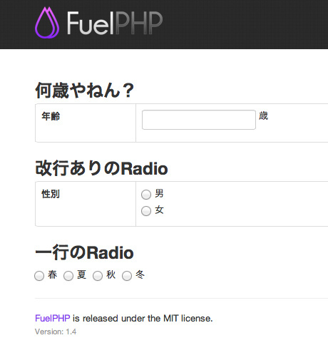

# FuelPHP の Fieldset クラスをこんな風に拡張してまーす、という話 [@omoon](https://twitter.com/omoon)

[FuelPHP Advent Calendar 2012](http://atnd.org/events/33753) の 7 日目の記事です。昨日は [@ounziw](https://twitter.com/ounziw) さんの『[ユニットテストのすすめ](http://ounziw.com/2012/12/06/phpunit/)』でした。

↑関係ないけど、昨日[イカセンター新宿総本店](http://www.uobaka.com/store_info/store_ika.html)で食べた紋甲イカ。美しい。

みなさんこんにちは。7 日目担当の [omoon](https://twitter.com/omoon) です。

2012 年は、5 月の PHP カンファレンス関西で、

- [FuelPHPをさわってみて](http://www.slideshare.net/sotaroomura/fuelphp "FuelPHPをさわってみて") from [Sotaro Omura](http://www.slideshare.net/sotaroomura)

この話をしたのをきっかけに、まさに、FuelPHP とともに forge し続けた 1 年でした。2012 年も残り少ないですが、悔いの残らないように forge しまくって、2013 年も引き続き forge しまくりたいと思います。

さて、FuelPHP では、フォームを扱う場合、[Form クラス](http://fuelphp.com/docs/classes/form.html)と、[Validation クラス](http://fuelphp.com/docs/classes/validation/validation.html)という 2 つのクラスを使います。

また、それらをまとめてオブジェクト指向風に扱うための [Fieldset クラス](http://fuelphp.com/docs/classes/fieldset.html)というクラスも用意されています。

僕の場合は、基本的に Fieldset クラスを使ってフォームを扱うのですが、使っているうちに、ここがこうなってたら便利なのになー、とか、こういうメソッドあればいいのに、っていうのがいくつか出てきたので、自分用に Fieldset クラスを拡張しています。

今日はその一部を晒します。

## この拡張でなにがやりたいか

この拡張でやりたいことを簡単にまとめると、

1.  view でのレイアウトの自由度を高めたい
2.  自動的に CSRF トークンを含めたい
3.  フォーム要素の生成でよくあるパターンをサッと呼び出したい

の 3 つになります。

下で詳しく説明しますが、やりたいことをざっくりコードで説明すると、

~~~
class Controller_Welcome extends Controller
{
    public function action_index()
    {
        $fieldset = Myfieldset::forge('sample');
        $fieldset->addTextForNumeric('age', '年齢');
        $fieldset->addRadioWithBr('gender', '性別', array(1 => '男', 2 => '女'));
        $fieldset->addRadioInline('season', '一番好きな季節', array(1 => '春', 2 => '夏', 3 => '秋', 4 => '冬'));
        $view = View::forge('welcome/index');
        $view->set_safe(array('form' => $fieldset->getFormElements('post_url')));
        return Response::forge($view);
    }
}
~~~

コントローラで↑このように、`Myfieldset::forge()`して、

~~~
<?php echo $form['open']; ?>

<h2>何歳やねん？</h2>
<table class="table table-bordered">
<tr>
<th class="span2"><?php echo $form['age']['label'];?></th>
<td><?php echo $form['age']['html'];?> 歳</td>
</tr>
</table>

<h2>改行ありのRadio</h2>
<table class="table table-bordered">
<tr>
<th class="span2"><?php echo $form['gender']['label'];?></th>
<td><?php echo $form['gender']['html'];?></td>
</tr>
</table>

<h2>一行のRadio</h2>

<?php echo $form['season']['html'];?>

<?php echo $form['close']; ?>
~~~

ビューファイルで↑このように書いて、

~~~
<form action="http://localhost:8080/post_url" method="post" id="form_sample" accept-charset="utf-8">
<input name="fuel_csrf_token" value="c9313a400c254e58c0d23f7fd599c297" type="hidden" id="form_fuel_csrf_token" />
<h2>何歳やねん？</h2>
<table class="table table-bordered">
<tr>
<th class="span2">年齢</th>
<td><input type="text" class="input-medium" style="ime-mode:disabled" id="form_age" name="age" /> 歳</td>
</tr>
</table>

<h2>改行ありのRadio</h2>
<table class="table table-bordered">
<tr>
<th class="span2">性別</th>
<td><label class="radio"><input type="radio" id="form_gender_0" name="gender" value="1" /><label for="form_form_gender_0">男</label></label><label class="radio"><input type="radio" id="form_gender_1" name="gender" value="2" /><label for="form_form_gender_1">女</label></label></td>
</tr>
</table>

<h2>一行のRadio</h2>

<label class="radio inline"><input type="radio" id="form_season_0" name="season" value="1" /><label for="form_form_season_0">春</label></label><label class="radio inline"><input type="radio" id="form_season_1" name="season" value="2" /><label for="form_form_season_1">夏</label></label><label class="radio inline"><input type="radio" id="form_season_2" name="season" value="3" /><label for="form_form_season_2">秋</label></label><label class="radio inline"><input type="radio" id="form_season_3" name="season" value="4" /><label for="form_form_season_3">冬</label></label>

</form>
~~~

結果として、↑このような出力を得たい、ということです。

表示はこうなります。

Myfieldset クラスはこんな感じです。

わかりにくいですね。以下、説明します。

## ポイント

### 各要素のラベルと html が別々に呼び出せるので、view ファイル上でのレイアウトの自由度が上がる

各要素のラベルと html が、それぞれ

    $form['age']['label']
    $form['age']['html']

として別々に呼び出すことができるようになります。

Form クラスの`build()`メソッドは、ラベルと html 要素を、決まったレイアウトを一気に出したい場合には便利なんですが、ちょっとレイアウトを触りたい時にうまくいきません。

なので、こうやって別々に呼び出せるようにしておくと、view ファイル側で色々といじれて嬉しいです。

### CSRF トークンが自動的に含まれるので、めんどくさくないし、出し忘れたりしない

基本的に、フォームには、セキュリティ対策としての CSRF トークンを含めることになるので、何も考えなくても勝手に追加されるようにしました。

これで、view ファイルから

    $form['open']

と呼べば、明示的に追加しなくても、

    <form action="http://localhost:8080/post_url" method="post" id="form_sample" accept-charset="utf-8">
    <input name="fuel_csrf_token" value="c9313a400c254e58c0d23f7fd599c297" type="hidden" id="form_fuel_csrf_token" />

みたいに、出力されるようになって嬉しいです。

### フォーム要素の生成でよくあるパターンをサッと呼び出せるので、何回も同じこと書かなくて良い

例えば、数値型の入力を受け付ける場合は、値が数値かどうか必ずチェックします。また、ime-mode なんかも適切に設定してあげると親切です。

なので、

    return $this->add(
        $name,
        $label,
        array(
            'class' => 'input-medium',
            'style' => 'ime-mode:disabled'
        )
    )->add_rule('valid_string', 'numeric')->set_template('{field}');

という感じにして、入力値が数値かどうかの判定を`add_rule`したり、`ime-mode:disabled`をスタイル指定したりしています。

これで、コントローラ側では、

    $fieldset->addTextForNumeric('age', '年齢');

と書くだけです。スッキリ！スッキリ！

このように、自分がよく使う要素を生成するメソッドを、スタイルやバリデーション込みで用意しておけば、コントローラからさっと呼び出せて便利です。

ちなみに、ぼくのかんがえたさいきょうの拡張は、こんなやつが色々と溜まってきて良い感じになっているのですが、今回は、ラジオボタンで、選択肢を改行するパターンと改行しないパターンを例に上げてみました。

    public function addRadioInline($name, $label, $options)
    {
        return $this->add(
            $name,
            $label,
            array(
                'type'    => 'radio',
                'options' => $options,
            )
        )->set_template('{fields}<label class="radio inline">{field}{label}</label>{fields}');
    }

    public function addRadioWithBr($name, $label, $options)
    {
        return $this->add(
            $name,
            $label,
            array(
                'type'    => 'radio',
                'options' => $options,
            )
        )->set_template('{fields}<label class="radio">{field}{label}</label>{fields}');
    }

こんな感じで、`set_template`メソッドを使って、要素生成時のタグの出し分けをするようにしています。

えーっと、結構長くなってきたので、そろそろ、このあたりで。。

フォームの作りこみは、システムのユーザビリティに大きく影響しますので、これからもどんどん拡張していって良い感じに育てていきたいと思っています。

明日は、[@web2citizen](https://twitter.com/web2citizen) さんの、『FuelPHPのスパムフィルタパッケージ』です。楽しみですね！

では、みなさん、良いクリスマスを！そして、来年もガンガン forge しましょう！

>**@omoon**
>
>
>
>Twitter: [@omoon](https://twitter.com/omoon)
>
>Blog: [http://blog.omoon.org/](http://blog.omoon.org/)

