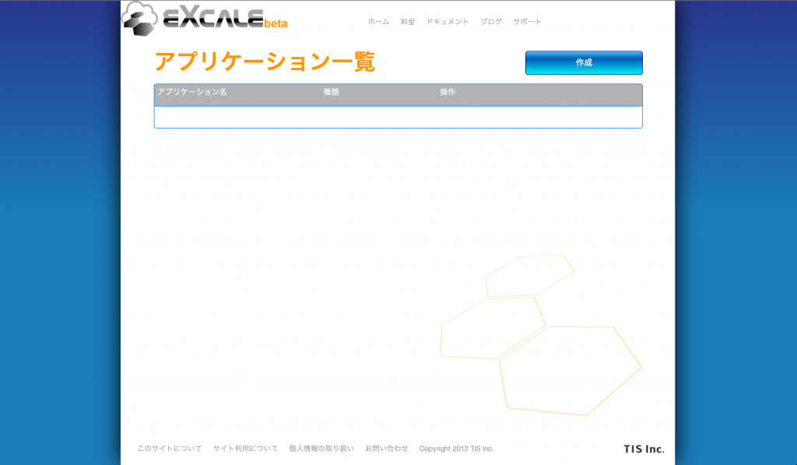
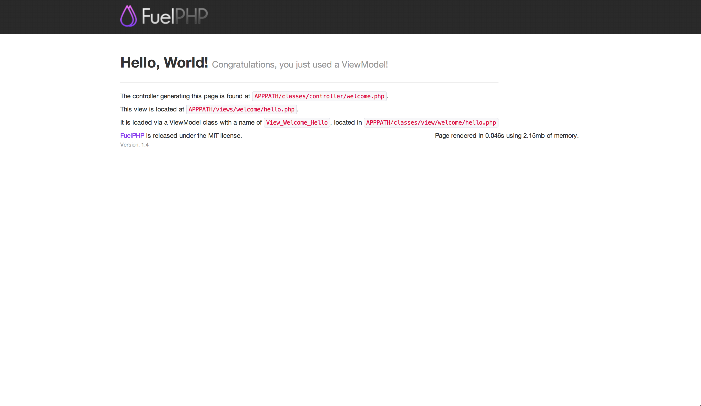
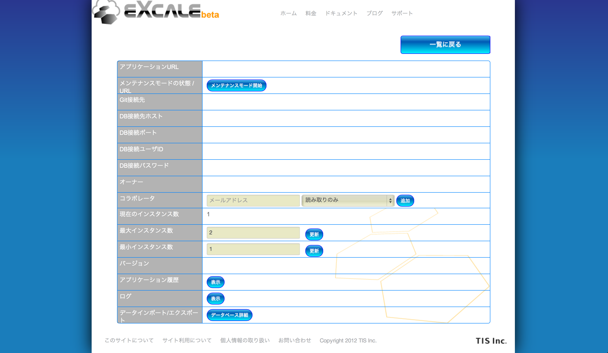
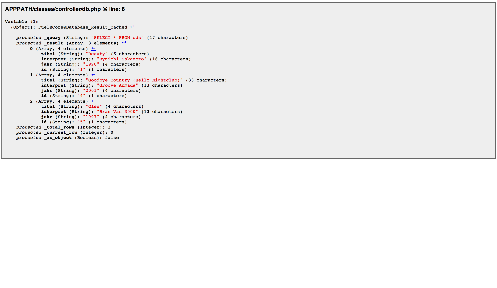

FuelPHP + eXcale [@yamamoto_manabu](https://twitter.com/yamamoto_manabu)
================

[FuelPHP Advent Calendar 2012](http://atnd.org/events/33753 "FuelPHP Advent Calendar 2012")の13日目担当の[@yamamoto\_manabu](https://twitter.com/yamamoto_manabu "@yamamoto_manabu")です。  
 昨日は[@seltzer](https://twitter.com/seltzer "@seltzer")さんの「Coda + FuelPHPでお手軽開発環境を作る」でした。

私は、Eclipse→NetBeans→PhpStormをお試し中。と定番IDEを渡り歩いてきたのですが、記事を読ませて頂くとCodaもあるある機能は網羅してそうですし、iPad版もあるようなので、ちょっと浮気してみようと思います。

さて、今日で13日目といことで折り返し地点を迎えた訳ですが、本日のお題は今年10月にTISさんが公開したPaaSサービス**「eXcale(えくすけーる)」**です。  
 気にはなっていたものの触れず仕舞いだったのですが、今回「FuelPHP Advent Calendar 2012」に参加させて頂くあたって、題材にさせて頂こうと思います。

まずは簡単に「eXcale」のご紹介。オフィシャルサイトは[こちら](https://www.excale.net/ "eXcaleオフィシャルサイト")。

ほぼオフィシャルサイトからの抜粋ですが、以下のような感じ。

1.  「eXcale」は、オートスケール、負荷分散の機能を有したPaaSサービスです
2.  インスタンスに割り当てられるメモリは最大268MB
3.  対応言語はRuby、Java、PHP、Node.js。PHPのバージョンは5.3。フレームワークの制限はありません
4.  データベースはMySQL5.5。容量は500MB
5.  アプリケーションデプロイはGit、ブラウザからのアップロードに対応しています
6.  β版ということで**無料！**料金周りは2013年春頃にアナウンスがあるようです
7.  国産ということで**ドキュメントが日本語**。英語アレルギーの方には朗報です

という訳でPHPも5.3なので、FuelPHPが動くはず。やってみましょう。  

アプリケーション作成
--------------------

[eXcaleオフィシャルサイト](https://www.excale.net/ "eXcaleオフィシャルサイト")でサインアップを済ませるとアプリケーション一覧画面が表示されます。

右上の青い「作成」ボタンをクリックして、アプリケーション作成画面に遷移したら、アプリケーション名を入力、言語はPHPを選択して「作成」ボタンをクリックします。  
 ここで指定したアプリケーション名は、**http://アプリケーション名.excale.net**のようにURLに利用されるので、慎重かつ大胆に決めましょう。

アプリケーションパッケージの作成
--------------------------------

今回はGitではなく、ブラウザからのアップロードでアプリケーションをデプロイしてみようと思います。  
 ブラウザからアップロードする際は、tar.gz形式にする必要があるので、そのアプリケーションパッケージを作成します。

[FuelPHPオフィシャルサイト](http://fuelphp.com "FuelPHPオフィシャルサイト")からFuelPHPをダウンロードします。  
 ＃v1.1, 1.2の頃から遠ざかっていたのですが、ずいぶんと印象変わりましたね。。。

ダウンロード時点ではzip形式になっているので、これをtar.gz形式に固め直します。

と、その前に、default\_timezoneの設定が必須になったようなので、設定ファイルを修正します。  
 「fuel/app/config/config.php」を以下のように修正します。

~~~~ {.brush: .php; .title: .; .notranslate title=""}
return array(
	'default_timezone' => 'Asia/Tokyo'
);
~~~~

それでは気を取り直してtar.gz形式に。参考までに私の環境でのコマンドを。  
 FuelPHPのバージョンは1.4を前提にしています。  
 またtar.gz形式にする際、docsなど不要なファイル群も含めてしまっていますが、デモということで大目に見てくださいませ。

~~~~ {.brush: .bash; .title: .; .notranslate title=""}
cd /fuelphp-1.4/
tar -czf ./app.tar.gz .
~~~~

アプリケーションパッケージができたら、早速アップロードしてみます。  
 eXcaleのアプリケーション一覧で、作成したアプリケーションの行にあるアップロードボタンをクリック。  
 作成したアプリケーションパッケージを選択し、アップロード。

エラーメッセージが表示されなければ、アップロード＆デプロイは成功と思われますが、結果はログからも確認することができます。  
 アプリケーション一覧の詳細ボタンをクリック、ログ行の表示ボタンをクリック、ログ種類にシステムログを選択し、表示ボタンをクリック。で、ログを確認することができます。

こんな感じのログが出力されていればOKです。

~~~~ {.brush: .plain; .title: .; .notranslate title=""}
Tue Dec 11 21:15:23 UTC 2012 [phptest] 2012-12-11 21:15:23 Stop existing instance..
Tue Dec 11 21:15:23 UTC 2012 [phptest] 2012-12-11 21:15:23 Create and start new instance..
Tue Dec 11 21:15:25 UTC 2012 [phptest] 2012-12-11 21:15:25 Instance stopped.
Tue Dec 11 21:15:29 UTC 2012 [phptest] 2012-12-11 21:15:29 Deploying..
Tue Dec 11 21:15:30 UTC 2012 [phptest] 2012-12-11 21:15:30 Deployed.
Tue Dec 11 21:15:34 UTC 2012 [phptest] 2012-12-11 21:15:34 Instance started.
~~~~

それでは、**http://アプリケーション名.excale.net/public/index.php/hello**にアクセスしてみましょう。  
 見慣れた画面が表示されたら無事成功です。  

ここまでの手順は[コチラ](http://doc.excale.net/getting_started/getting_started_with_php.html "PHPアプリケーションのデプロイ")の内容を簡略化したものなので、もっと詳しくという方はリンク先をご参照あれ。

DB接続
------

もっと苦戦するかと思いきや、あっさりとトラブル無くデプロイできてしまったので、DB接続にもチャレンジしてみたいと思います。

DBの接続情報はアプリケーション詳細画面で確認できます。画像は諸々マスクしてます。  

この内容を元に設定ファイルを修正します。  
 「fuel/app/config/development/db.php」を以下のように修正します。

~~~~ {.brush: .php; .title: .; .notranslate title=""}
<?php
/**
 * The development database settings. These get merged with the global settings.
 */
return array(
    'default' => array(
        'connection' => array(
            'dsn' => 'mysql:host=<DB接続先ホスト>;port=<DB接続ポート>;dbname=<アプリケーション名>',
            'username' => '<DB接続ユーザID>',
            'password' => '<DB接続パスワード>',
        ),
    ),
);
~~~~

次にMySQLの準備です。  
 eXcaleのMySQLにデータをインポートする場合には、SQLファイルかmysqldumpで出力したファイルが利用可能とのことです。  
 正確な情報は[コチラ](http://doc.excale.net/getting_started/getting_started_data_import_export.html "データのインポート")。

私はXAMPPのphpMyAdminを使って、これまたXAMPPのデモアプリが使っているcdcol.cdsのデータをSQL形式でエクスポートしてテストデータを作成しました。  
 できあがったのがコチラ。

~~~~ {.brush: .sql; .title: .; .notranslate title=""}
-- phpMyAdmin SQL Dump
-- version 3.2.4
-- http://www.phpmyadmin.net
--
-- ホスト: localhost
-- 生成時間: 2012 年 12 月 11 日 19:05
-- サーバのバージョン: 5.1.44
-- PHP のバージョン: 5.3.1

SET SQL_MODE="NO_AUTO_VALUE_ON_ZERO";

/*!40101 SET @OLD_CHARACTER_SET_CLIENT=@@CHARACTER_SET_CLIENT */;
/*!40101 SET @OLD_CHARACTER_SET_RESULTS=@@CHARACTER_SET_RESULTS */;
/*!40101 SET @OLD_COLLATION_CONNECTION=@@COLLATION_CONNECTION */;
/*!40101 SET NAMES utf8 */;

--
-- データベース: `cdcol`
--

-- --------------------------------------------------------

--
-- テーブルの構造 `cds`
--

DROP TABLE IF EXISTS `cds`;
CREATE TABLE IF NOT EXISTS `cds` (
  `titel` varchar(200) DEFAULT NULL,
  `interpret` varchar(200) DEFAULT NULL,
  `jahr` int(11) DEFAULT NULL,
  `id` bigint(20) unsigned NOT NULL AUTO_INCREMENT,
  PRIMARY KEY (`id`)
) ENGINE=MyISAM  DEFAULT CHARSET=latin1 AUTO_INCREMENT=10 ;

--
-- テーブルのデータをダンプしています `cds`
--

INSERT INTO `cds` (`titel`, `interpret`, `jahr`, `id`) VALUES
('Beauty', 'Ryuichi Sakamoto', 1990, 1),
('Goodbye Country (Hello Nightclub)', 'Groove Armada', 2001, 4),
('Glee', 'Bran Van 3000', 1997, 5);
~~~~

アプリケーション詳細画面で「データベース詳細」ボタンをクリックすると遷移するデータインポート/エクスポート画面で、作成したSQLファイルをインポートします。

これでDB接続する為の準備と、データの作成は終わりましたので、検証用のPHPコードを書いてみます。

ルーティングを追加。  
 「fuel/app/config/routes.php」を以下のように修正します。

~~~~ {.brush: .php; .title: .; .notranslate title=""}
<?php
return array(
    '_root_'  => 'welcome/index',  // The default route
    '_404_'   => 'welcome/404',    // The main 404 route

    'hello(/:name)?' => array('welcome/hello', 'name' => 'hello'),
    'db' => 'db/index',
);
~~~~

コントローラを作成。  
 「fuel/app/classes/controller/db.php」を新規作成します。

~~~~ {.brush: .php; .title: .; .notranslate title=""}
<?php

class Controller_Db extends Controller
{
    public function action_index()
    {
        $tests = DB::query('SELECT * FROM cds')->execute();
        Debug::dump($tests);
    }
}
~~~~

それでは、**http://アプリケーション名.excale.net/public/index.php/db**にアクセスしてみましょう。  
 以下のように表示されればDB接続成功です。  

如何だったでしょう？初見でも数時間でアプリケーションのデプロイ、DB接続に辿り着けたのではないでしょうか。  
 HerokuやPagoda Boxもありますが、なんだかんだで日本語ドキュメントがあると、やっぱり手を出すに当たってのハードルは下がる印象です。  
 商用利用に足るかどうかは不安ですが、Controller\_Restを使って、個人作成スマホアプリの対向WebAPIを作る、といったシチュエーションにはバッチリなのではないでしょうか。

まだβ版ということで料金体系が不明ですが、そこはTISさんが頑張ってくれることを信じつつ、無料の間に遊び倒したいと思います！

さて、明日は[@uemera](https://twitter.com/uemera "@uemera")さんの「就職活動サイトの構築にFuelPHPを使ったので事例紹介」です。  
 事例紹介ということで、リアルな声が楽しみですね！

>**@yamamoto_manabu**
>
>
>
>Twitter: [@yamamoto_manabu](https://twitter.com/yamamoto_manabu)
>
>Blog: [http://yamamoto.phpapps.jp/](http://yamamoto.phpapps.jp/)

