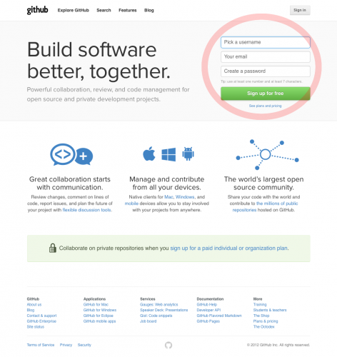
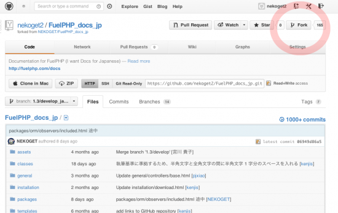
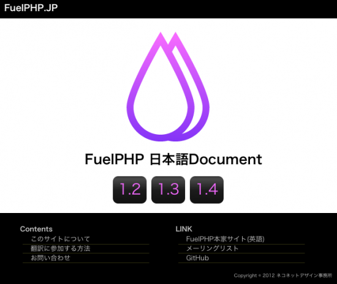

### [FuelPHPドキュメント翻訳へのお誘い](http://pneskin2.nekoget.com/press/?p=1044)

Filed under: [FuelPHP](http://pneskin2.nekoget.com/press/?cat=34 "FuelPHP の投稿をすべて表示"),[PHP](http://pneskin2.nekoget.com/press/?cat=6 "PHP の投稿をすべて表示") — NEKOGET @ 12:47:09

http://offerbox.jp/engineer/440/

ありがたい事に、今年も[FuelPHP Advent Calendar 2012](http://atnd.org/events/33753)に参加です。  
 [@uemeraさん](https://twitter.com/uemera)の記事「[就職活動サイトの構築にFuelPHPを使ったので事例紹介](http://offerbox.jp/engineer/440/)」に続いての記事になります。

FuelPHPのドキュメントを、ドキュメントはやはり日本語で読みたいよねということで翻訳を始めました。  
 [githubのgitレポジトリ](https://github.com/NEKOGET/FuelPHP_docs_jp/)を利用し、  
 翻訳をすすめています。今日時点で、165人の方にforkされ、翻訳が進められています。

### 翻訳をしていて良かったと思う事

FuelPHPに対してではなく、技術そのものに対しての理解が深まっているように感じています。  
 1文書を翻訳するのにかかる時間は、翻訳を始めた頃よりも、今の方が長い時間を必要としています。  
 単語の意味がわからず、単語の意味をしらべるのですが、それでも意味がわからず、  
 その単語が使われている英文を探し、その英文に書かれている事で関連ありそうな日本語で検索してみたり、本体のコードを読み返してみたりしています。  
 ただ読むだけだった時とは違い、さらりと流し読んでいた部分の理解が深くなっていることを体感しています。基礎として知っておくべき事と思われる事への理解が深まる機会を得て、ここ数年不安だったもやもやしていたことへの解決は、本当にありがたいです。

### 翻訳への参加方法

(1)GitHubにアカウントを作成してください。  
 FuelPHP Documentの日本語翻訳はgithubを利用しています。  
 そのため、githubアカウントが必要です。  
 

### (2)githubの日本語ドキュメントをforkしてください。

  
 **  
 gitを使う場合**  
 forkをした後については、東京での FuelPHP 勉強会の sho さんの発表資料が参考になります。  
 (22ページ目あたりからが方法についての解説です)  
 [http://www.slideshare.net/akagisho/lets-translate-fuelphp-docs](http://www.slideshare.net/akagisho/lets-translate-fuelphp-docs)

**githubの機能を使って、ブラウザで翻訳作業をする場合**  
 MIZUNOさんの[github でドキュメント日本語化](http://ounziw.com/2011/12/01/github-localize/)がとてもわかりやすく解説くださっています。

### (3)README.md を読み、翻訳をはじめましょう

翻訳についての注意点、お約束が書かれています。  
 翻訳を始める前に一読をお願いします。  
 **翻訳に煮詰まったら…..**  
 翻訳をしていると、単語の意味はわかっても訳せないものがでてきたりと躓く場面があります。  
 そんなときは、[google groupにfuelphp.jpのML](https://groups.google.com/forum/?fromgroups#!forum/fuelphp_jp)があります。  
 気軽に相談をしてみてくださいね。

### (4)翻訳ができたら、pull request をお願いします。

翻訳ができたら、pull requestをお願いします。  
 mergeされると、ここにその履歴が表示されます。  
 [1.3の翻訳の履歴](https://github.com/NEKOGET/FuelPHP_docs_jp/commits/1.3/develop_japanese)  
 [1.4の翻訳の履歴](https://github.com/NEKOGET/FuelPHP_docs_jp/commits/1.4/develop_japanese)  
 [1.5の翻訳の履歴](https://github.com/NEKOGET/FuelPHP_docs_jp/commits/1.5/develop_japanese)

まだまだ翻訳が追いついていません。  
 1.4 , 1.5はまだ翻訳はあまり進んでいないため、翻訳し放題です(\^-\^)

### 日本語翻訳されたドキュメントについて

githubからダウンロードしてローカルで見るのも良いですが、その手間を省くためにweb上に翻訳されたレポジトリを展開しています。  
 fuelphp.jpというサイトで公開しています。  
 (近日中に1.5へのリンクも追加する予定です。)  
 [http://fuelphp.jp/  
 ](http://fuelphp.jp/)

### 最後に

翻訳への参加は、フレームワークが利用している技術についての理解も深まります。  
 ついでに英語力を鍛える機会となります。  
 私にとってはその2つの存在がとても大きく、毎日少しずつですが翻訳を続けています。

FuelPHPのドキュメント翻訳に興味を持たれましたら、ぜひ参加をお願いします。  
 質問等、微力ですができるかぎり応えたいと思います(\^-\^)/

明日は@mayama4uさんの「FuelPHPで作るFacebook診断アプリ」です。  
 お楽しみに！

