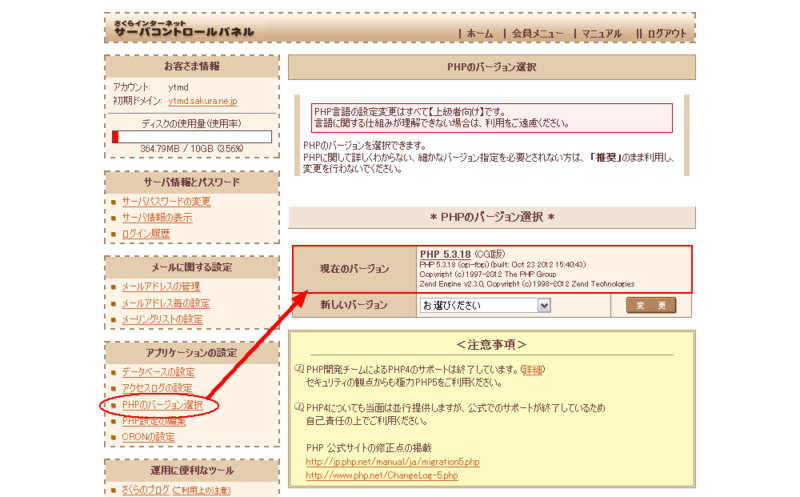
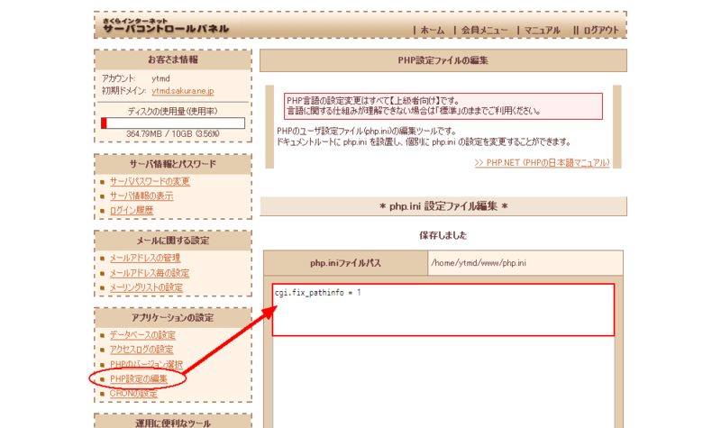
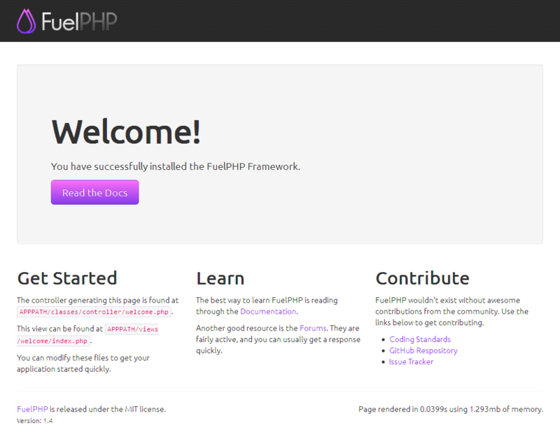
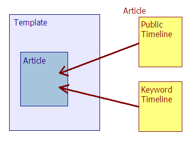
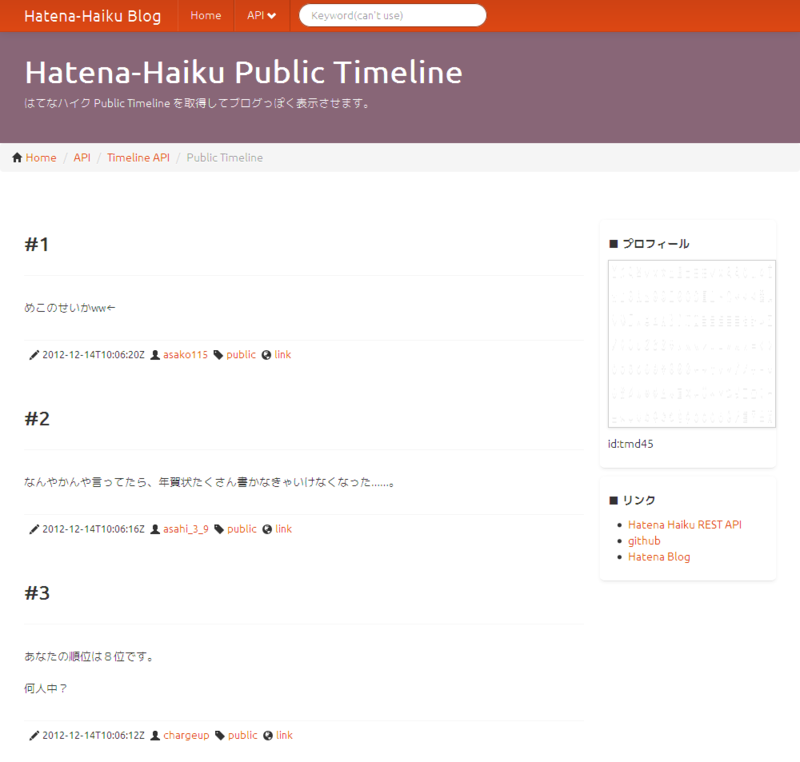

さくらのレンタルサーバで FuelPHP を使ってはてなハイクブログを作る－ViewModel を使ってみる編
==========================================================================================================================================

この記事は [FuelPHP Advent Calendar 2012](http://atnd.org/events/33753) の 18 日目の記事です。昨日は @[ootatter](http://twitter.com/ootatter) さんによる『[fuelphpで既存DBをあつかうとか](http://blog.milds.net/2012/12/fuelphpdb.html)』でした。

本日の担当は、毎年クリスマスには仕事で問題が起こりクルシミマス恒例になりつつあります、@[tmd45](http://twitter.com/tmd45) です。

FuelPHP 標準のサーバキャッシュと「[はてなハイクAPI](http://developer.hatena.ne.jp/ja/documents/haiku/apis/rest)」、ViewModel を利用したブログのようなものを作ってみましたので、その全貌を公開したいと思います。

-   さくらのレンタルサーバーで FuelPHP を動かす
-   ViewModel を含めて MVC をひととおり使ってみる
-   はてなの API を使ってみる

などを行っています。

長いですが、マイナーな組み合わせすぎて需要が無いことをひそかに期待してます(笑)。  
 なお、使う人がいらっしゃるか分かりませんが記事中のソースコードは MIT ライセンスです。

では、よろしくお願いします。

## 1. さくらのレンタルサーバで FuelPHP を準備する

利用しているのは*スタンダードプラン*です。なおスタンダードより下のライトプランだと SFTP や SCP が使えなくてちょっと不便なので、動的なサイトを作りたい場合はスタンダードプラン以上で契約されるのがオススメです。さらに言えば、レンサバより VPS や Cloud なんちゃら系のホスティングサービスを使ったほうが利便性は良いです。

さくらのレンサバを使った理由は「そこに放置中のレンサバがあったから」以外のなにものでもないのであしからず。

### PHP のバージョンを確認する

お使いのレンサバで動く PHP のバージョンを確認します。FuelPHP を動作させるために PHP 5.3 以上を利用しましょう。必要であれば下記の画面で設定を変更してください。

### php.ini の編集

さくらのレンサバはコントロールパネルから php.ini の編集が可能です。  
 FuelPHP を正常に動作させるには `cgi.fix_pathinfo = 1` の記述が必要です。リクエスト URL の取得に、cgi 版 PHP ではこの設定を行って `$_SERVER["ORIG_PATH_INFO"]` の利用を有効にする必要があるためです。

と、説明しておきますが、FuelPHP Core 内で `$_SERVER["ORIG_PATH_INFO"]` を利用しているのは私が見た限りでは [Input クラスだけみたい](https://github.com/fuel/core/blob/1.4/master/classes/input.php#L128)です。とりあえずこの設定はやっておきましょう。

以下の記事を参考にさせていただきました。

-   [さくらレンタルサーバーにFuelPHPをインストール - 2hours](http://d.hatena.ne.jp/good-speed/20121002/1349148273)
-   [PHPフレームワークはどのようにリクエストされたURLを取得しているか? - localdisk](http://d.hatena.ne.jp/localdisk/20090524/1243149438)

### FuelPHP を用意する

[FuelPHP 公式サイト](http://fuelphp.com/)から最新版(執筆時点でv1.4)の FuelPHP アーカイブ(zip)をダウンロードします。アーカイブを展開して、ドキュメントルート内の構成を以下のようにしました。

    アーカイブ内(変更前)のディレクトリ構成
    /fuelphp-1.4
      |-- /docs
      |-- /fuel
      |-- /public
      |  |-- /assets
      |  |-- .htaccess
      |  `-- index.php
      |-- oil
      |-- README.md
      `-- ...

ドキュメントや README、使わない oil などを削除します。また、public ディレクトリの中身をドキュメントルートに持ってきます。

    変更後のディレクトリ構成
    /hhblog
      |-- /fuel
      |-- /assets
      |-- .htaccess
      `-- index.php

ディレクトリ構成を変更したので、index.php に記述されているパスも修正します。diff だとわかりにくいですが、`/../fuel` から始まるパスが `/fuel` になります。

~~~~ {.code .lang-diff data-lang="diff" data-unlink=""}
$ diff fuelphp-1.4/public/index.php hhblog/index.php
16c16
< define('APPPATH', realpath(__DIR__.'/../fuel/app/').DIRECTORY_SEPARATOR);
---
> define('APPPATH', realpath(__DIR__.'/fuel/app/').DIRECTORY_SEPARATOR);
21c21
< define('PKGPATH', realpath(__DIR__.'/../fuel/packages/').DIRECTORY_SEPARATOR);
---
> define('PKGPATH', realpath(__DIR__.'/fuel/packages/').DIRECTORY_SEPARATOR);
26c26
< define('COREPATH', realpath(__DIR__.'/../fuel/core/').DIRECTORY_SEPARATOR);
---
> define('COREPATH', realpath(__DIR__.'/fuel/core/').DIRECTORY_SEPARATOR);
~~~~

  
 Web API を使用する際にはタイムスタンプなどが重要になってくる場合もあるので、タイムゾーンの設定もしておきました。役に立っているのかはいまいち分かりませんが・・・

~~~~ {.code .lang-php data-lang="php" data-unlink=""}
ファイル：~/hhblog/fuel/app/config/config.php
<?php
/* 中略 */

return array(
  'default_timezone' => 'Asia/Tokyo'    // タイムゾーンを設定
);
~~~~

  
 またセキュリティの観点から、Web から見えてしまう FuelPHP のエラー表示は OFF にしておくほうが良いです(参考：[FuelPHP でのセキュリティ対策(3) - A Day in Serenity @ kenjis](http://d.hatena.ne.jp/Kenji_s/20111224/1324731427))。自分の場合は開発環境と公開環境を一緒くたにするという危険極まりない遊びをしていたのでエラーは出しっぱなしです・・・(;\^\_\^)

~~~~ {.code .lang-php data-lang="php" data-unlink=""}
ファイル：~/hhblog/index.php
<?php
/**
 * Set error reporting and display errors settings.  You will want to change these when in production.
 */
error_reporting(-1);
ini_set('display_errors', 1);    // この引数を 0 にする。
~~~~

  
 レンタルサーバへの配置ですが、今回はレンサバのドキュメントルート `$HOME/www` 配下に、上記の `hhblog` ディレクトリを配置することにします。アクセス時の URL は `http://{user-id}.sakura.ne.jp/hhblog/` になります。

この配置であれば、.htaccess ファイルを修正する必要はありません。アーカイブに在ったものをそのまま使用すれば Mod\_Rewrite が仕事してくれます。

私は動作環境を本番(production)にするため、以下の部分だけ変更(コメント化を解除)しました。

~~~~ {.code .lang-diff data-lang="diff" data-unlink=""}
$ diff fuelphp-1.4/public/.htaccess hhblog/.htaccess
2c2
< # SetEnv FUEL_ENV production
---
> SetEnv FUEL_ENV production
~~~~

### FuelPHP を放り込む

準備した `hhblog` ディレクトリの FuelPHP 一式を、SFTP でも SCP でも好きな方法で、レンタルサーバのドキュメントルートに放り込みましょう。`$HOME/www/hhblog` となるように配置します。

手動インストール(oil を使わないで配置する)を行ったので、ディレクトリのパーミッションの変更も自分で行います(参考：[Instruction - Installation - FuelPHP Documentation](http://fuelphp.com/docs/installation/instructions.html))。

以下の４つのディレクトリのパーミッションを 777(rwxrwxrwx)にします。FTP/SCP ツールで変更しても良いですし、さくらのコントロールパネルからファイルマネージャーを使用して変更することも可能です(ディレクトリを 右クリック → プロパティ で属性の変更が可能)。

    以下の４つのディレクトリを書込み可にする
    $HOME/www/hhblog
        |-- /fuel
        |    |-- /app
        |    |    |-- /cache
        |    |    |-- /config
        |    |    |-- /logs
        |    |    |-- /tmp
        ...

これでインストールは完了です。`http://{user-id}.sakura.ne.jp/hhblog/` にアクセスすれば、おなじみの Welcome ページが表示されます。おめでとうありがとう。

やることが多く見えますが、結構単純です。さくらのレンタルサーバでも FuelPHP は(とりあえず)簡単に動作します。

## 2. はてなハイク API の利用

フレームワークの準備が出来ましたので、ここから実装に入ります。コードはとくに省略せずに貼り付けてますので、長いです。

> 補足：  
>  本来は開発環境で作って、テストして、完成したものを公開環境へアップロードしますよね(苦笑)  
>  今回ちょっと不便な場所で開発を行っていたため、公開環境で動作確認などを行っていました・・・  
>  この辺りはツッコミ無用でございます／(\^o\^)＼
>
> また、筆者は Java 屋なので、PHP 的におかしな書き方をしているところがあったらごめんなさい。  
>  そちらはツッコミいただけたら嬉しいです＼(\^o\^)／

はてなハイクの API を利用して記事を取得する処理を Model に作成します。  
 ちなみに今回利用した API では、認証を必要としません。なので認証部分の実装も考えません。

API は以下の２種類を使うことにしました。詳しくは API のドキュメントをご確認ください。

1.  [はてなハイクのトップページ(パブリック・タイムライン)](http://developer.hatena.ne.jp/ja/documents/haiku/apis/rest/timelines#public_timeline)
    -   引数はとくに無く、はてなハイクのトップページに表示されるタイムラインを取得します。

2.  [キーワードのエントリーページ(キーワード・タイムライン)](http://developer.hatena.ne.jp/ja/documents/haiku/apis/rest/timelines#keyword_timeline)
    -   引数にキーワードを指定(必須)し、そのキーワードのタイムラインを取得します。

  
 以下が実装です。**ちなみにテストはありません(!!?)。**また、一部の引数は API に合わせて定義しているだけで、利用していないです(汗)

~~~~ {.code .lang-php data-lang="php" data-unlink=""}
ファイル：~/hhblog/fuel/app/classes/model/api/hatena/haiku.php
<?php

class Model_Api_Hatena_Haiku extends Model
{

    /**
    * Using statuses/public_timeline (Japanese Domain).
    * 
    * AUTHORIZATION : no
    * HTTP METHOD   : GET
    * 
    * @link http://developer.hatena.ne.jp/ja/documents/haiku/apis/rest/timelines#public_timeline
    * 
    * @param string  $body_formats reaponse text format, see default value
    * @param integer $count        getting entries number, API default 20 max 200
    * @param integer $page         getting page number, API default 1 max 100
    * @param string  $since        no getting older than rfc1123-date("Mon, 26 Nov 2012 15:53:43 GMT")
    * 
    * @return string JSON
    */
    public static function getPublicTimeLine(
        $body_formats = "api,haiku,html,html_mobile,html_touch"
        , $count        = "20"
        , $page         = "1"
        , $since        = "Mon, 26 Nov 2012 15:53:43 GMT"
    ) {

        // リクエストURL
        $url = "http://h.hatena.ne.jp/api/statuses/public_timeline.json";

        // Option(UTF-8で符号化必要)
        $body_formats = urlencode($body_formats);

        // URL 組み立て
        $filename = $url . '?body_formats=' . $body_formats;

        // file_getコンテキストのオプション
        $opts = array(
            'http' => array(
                'method' => "GET",
                'header' => "Host: hoge.sakura.ne.jp\r\n" .
                            "Accept-language: ja\r\n" .
                            "User-Agent: " . Input::user_agent() . "\r\n"
            )
        );
        $context = stream_context_create($opts);

        // API の結果を json で取得
        $json = file_get_contents($filename, false, $context);

        // 取得した json 文字列をそのまま返却
        if($json != false)
        {
            return $json;
        }
        // 取得失敗したら空文字を返却
        else
        {
            return '';
        }

    }

    /**
    * Using statuses/keyword_timeline.
    * 
    * AUTHORIZATION : no
    * HTTP METHOD   : GET
    * 
    * @link http://developer.hatena.ne.jp/ja/documents/haiku/apis/rest/timelines#keyword_timeline
    *
    * @param string  $keyword      seatch keyword [required]
    * @param string  $body_formats reaponse text format, see default value
    * @param integer $count        getting entries number, API default 20 max 200
    * @param integer $page         getting page number, API default 1 max 100
    * @param string  $sort         getting entries sort, API default "new" is newer, "hot" is populer
    * @param string  $since        no getting older than rfc1123-date("Mon, 26 Nov 2012 15:53:43 GMT")
    * 
    * @return string JSON
    */
    public static function getKeywordTimeLine(
        $keyword
        , $body_formats = "api,haiku,html,html_mobile,html_touch"
        , $count        = "20"
        , $page         = "1"
        , $sort         = "new"
        , $since        = "Mon, 26 Nov 2012 15:53:43 GMT"
    ) {

        // リクエストURL
        $url = "http://h.hatena.ne.jp/api/statuses/keyword_timeline.json";

        // Option(UTF-8で符号化必要)
        $word         = urlencode($keyword);
        $body_formats = urlencode($body_formats);

        // URL 組み立て
        $filename = $url . '?word=' . $word . '&body_formats=' . $body_formats;

        // file_getコンテキストのオプション
        $opts = array(
            'http' => array(
                'method' => "GET",
                'header' => "Host: hoge.sakura.ne.jp\r\n" .
                            "Accept-language: ja\r\n" .
                            "User-Agent: " . Input::user_agent() . "\r\n"
            )
        );
        $context = stream_context_create($opts);

        // API の結果を json で取得
        $json = file_get_contents($filename, false, $context);

        // 取得した json 文字列をそのまま返却
        if($json != false)
        {
            return $json;
        }
        // 取得失敗したら空文字を返却
        else
        {
            return '';
        }

    }

}

/* End of file haiku.php */
/* Location: app/classes/model/api/hatena/haiku.php */
~~~~

file\_getコンテキストのオプションに指定する Host 名は、ご自分の環境にあわせて修正してください。

## 3. ViewModel を使ってブログ(表示部分のみ)を作る

ここからやっとブログ(っぽく)表示する実装を行っていきます。

View は贅沢(？)に Template を使ってみます。

さきに書いてしまいますが、最終的なディレクトリ構成は以下のようになりました。

    実装のディレクトリ構成
    $HOME/www/hhblog
        |-- /fuel
        |    |-- /app
        |    |    |-- /classes
        |    |    |    |-- /controller
        |    |    |    |    `-- hhblog.php
        |    |    |    |-- /model
        |    |    |    |    `-- ・・・
        |    |    |    `-- /view
        |    |    |         `-- /hhblog
        |    |    |              `-- /article
        |    |    |                   |-- keyword.php    (1)'
        |    |    |                   `-- public.php     (2)'
        |    |    |-- /views
        |    |    |    |-- /hhblog
        |    |    |    |    |-- /article
        |    |    |    |    |    |-- keyword.php    (1)
        |    |    |    |    |    `-- public.php     (2)
        |    |    |    |    `-- template.php
        ・・・

うーん、機能名失敗したな・・・(hhblog の hhblog コントローラ・・・orz)。

### View と Controller

では、どんどんコードを晒していきます。  
 まずはコントローラー。

~~~~ {.code .lang-php data-lang="php" data-unlink=""}
ファイル：~/hhblog/fuel/app/classes/controller/hhblog.php
<?php

/**
 * Hatena-Haiku Blog Controller.
 * 
 * hhblog's root controller.
 * 
 * @package app
 * @extends Controller
 */
class Controller_Hhblog extends Controller_Template
{

    public $template = 'hhblog/template';
    
    /**
    * Get Hatena-Haiku Public Timeline in ViewModel
    * and show blog style page.
    */
    public function action_public_timeline()
    {
        $this->template->set('title',       'Hatena-Haiku Public Timeline');
        $this->template->set('description', 'はてなハイク Public Timeline を取得してブログっぽく表示させます。');
        $this->template->set('active_api',  1);
        
        // 本文部分に ViewModel を利用
        $this->template->article = ViewModel::forge('hhblog/article/public');
        
    }
    
    /**
    * Get Hatena-Haiku Keyword Timeline in ViewModel
    * and show blog style page.
    * Now 'keyword' is Hatena user id 'id:hoge' style.
    */
    public function action_keyword_timeline()
    {
        $keyword = 'id:tmd45';
        
        $this->template->set('title',       'Hatena-Haiku Keyword Timeline');
        $this->template->set('description', 'はてなハイク Keyword Timeline からキーワード「' . $keyword . '」の結果を取得してブログっぽく表示させます。');
        $this->template->set('keyword', $keyword);
        $this->template->set('active_api',  2);
        
        // 本文部分に ViewModel を利用
        $this->template->article = ViewModel::forge('hhblog/article/keyword');
        $this->template->article->set('keyword', $keyword);
        
    }
}

/* End of file hhblog.php */
/* Location: app/classes/controller/hhblog.php */
~~~~

キーワード・タイムラインで指定するキーワードは、コントローラーに直書きしています。

-   `$keyword = 'id:tmd45';`

この文字列を変更すれば好きなキーワードを指定することができます。

指定したキーワードはビューモデルでも利用したいので、以下のように値を渡しています。

-   `$this->template->article->set('keyword', $keyword);`

  
 そして View 側のコードですが、全部載せると大変なので Gist に置いておきます。

-   [template.php on Gist](https://gist.github.com/4283992#file-template-php)
-   [public.php on Gist](https://gist.github.com/4283992#file-public-php)
-   [keyword.php on Gist](https://gist.github.com/4283992#file-keyword-php)

テンプレートのソースコード(template.php)の中で、コントローラーで ViewModel を forge した `$article` 変数を利用して記事を埋め込みます。

~~~~ {.code .lang-php data-lang="php" data-unlink=""}
ファイル：~/hhblog/fuel/app/views/hhblog/template.php の一部
<!-- CONTENT -->

            
<?php echo $article; ?>
            

<!-- /span9 -->
<!-- /CONTENT -->
~~~~

記事側のソースコード(public.php, keyword.php)では、API で取得した記事の配列を繰り返し表示させています。これがテンプレートの `$article` 部分に展開されます。

~~~~ {.code .lang-php data-lang="php" data-unlink=""}
ファイル：~/hhblog/fuel/app/views/hhblog/article/public.php の一部
<?php
    foreach ($articles as $a)
    {
?>
        <section class="hhblog-section">
            

                
<?php echo $a["html"]; ?>

            

        </section>
<?php
    } /* end foreach($articles) */
    unset($articles);
?>
~~~~

これらをサイトのトップページに表示させるために、ルーティングの設定も修正します。  
 サイトのトップにアクセスすると、キーワード・タイムラインが表示されます(1)。また `http://{user-id}.sakura.ne.jp/hhblog/public_timeline` にアクセスするとパブリック・タイムラインが、`http://{user-id}.sakura.ne.jp/hhblog/keyword_timeline` にアクセスするとキーワード・タイムラインが表示されるようにしました(2)。

~~~~ {.code .lang-php data-lang="php" data-unlink=""}
ファイル：~/hhblog/fuel/app/config/routes.php
<?php
return array(
// '_root_'  => 'welcome/index',              // コメント化
    '_root_'  => 'hhblog/keyword_timeline',    // 追加(1)
    '_404_'   => 'welcome/404',
    
    '(:segment)' => 'hhblog/$1',               // 追加(2)
    
    'hello(/:name)?' => array('welcome/hello', 'name' => 'hello'),
);
~~~~

### ViewModel！ViewModel！！

では、最後にお待ちかねのビューモデルです。

まずはパブリック・タイムライン用のビューモデル。API 制限を考慮して、新しいデータは 30 分に 1 回だけ取得するようにして、それ以外はキャッシュからデータを取得します。API の実行は Model を呼び出すだけです。

~~~~ {.code .lang-php data-lang="php" data-unlink=""}
ファイル：~/hhblog/fuel/app/classes/view/hhblog/article/public.php
<?php

/**
 * Hatena-Haiku Blog Public Timeline ViewModel.
 * 
 * @package app
 * @extends ViewModel
 */
class View_Hhblog_Article_Public extends ViewModel
{

    /**
    * Get Hatena-Haiku Public Timeline.
    * 
    * Data cache to make Access-control, 
    * and get data from cache in a time.
    */
    public function view()
    {
        $cache_id = 'hhblog_public_timeline_json';
        
        try
        {
            // キャッシュにあればキャッシュから取得
            $json = Cache::get($cache_id);
        }
        catch (\CacheNotFoundException $e)
        {
            // タイムライン取得(json)
            $json = Model_Api_Hatena_Haiku::getPublicTimeline();
            
            // キャッシュに保存(0.5時間)
            Cache::set($cache_id, $json, 3600 * 0.5);
        }
        
        // jsonデータの配列化
        $articles = Format::forge($json, 'json')->to_array();
        
        // Viewにセット
        $this->set('articles', $articles, false);

    }
}

/* End of file public.php */
/* Location: app/classes/view/hhblog/article/public.php */
~~~~

次にキーワード・タイムライン用のビューモデルです。パブリック・タイムラインと同じです。Model の実行時に引数にキーワードを渡しています。

~~~~ {.code .lang-php data-lang="php" data-unlink=""}
ファイル：~/hhblog/fuel/app/classes/view/hhblog/article/keyword.php
<?php

/**
 * Hatena-Haiku Blog Keyword Timeline ViewModel.
 * 
 * @package app
 * @extends ViewModel
 */
class View_Hhblog_Article_Keyword extends ViewModel
{

    /**
    * Get Hatena-Haiku keyword timeline.
    * 
    * Data cache to make Access-control, 
    * and get data from cache in a time.
    */
    public function view()
    {
        $cache_id = 'hhblog_keyword_timeline_json';
        
        try
        {
            // キャッシュにあればキャッシュから取得
            $json = Cache::get($cache_id);
        }
        catch (\CacheNotFoundException $e)
        {
            // タイムライン取得(json)
            $json = Model_Api_Hatena_Haiku::getKeywordTimeline($this->keyword);
            
            // キャッシュに保存(0.5時間)
            Cache::set($cache_id, $json, 3600 * 0.5);
        }
        
        // jsonデータの配列化
        $articles = Format::forge($json, 'json')->to_array();
        
        // Viewにセット
        $this->set('articles', $articles, false);

    }
}

/* End of file keyword.php */
/* Location: app/classes/view/hhblog/article/keyword.php */
~~~~

ここまで内容が一緒だと、あまり分けた意味がなさそうですが、応用編では表示内容を整形するという ViewModel 本来の処理を組み込んでいくのでこんな感じかな、と思います。

ちなみに応用編の記事はありません(笑)

取得したタイムラインのデータを View にセットする際に false を指定しています。

-   `$this->set('articles', $articles, false);`

これは API の応答結果より HTML でマークアップ済みのハイク記事本文(key='html')を、そのまま表示に利用しているためです。

## 4. 公開環境で動かそう

実装が完了して、テストが出来たら(苦笑)、用意してあったレンサバのフレームワーク上に変更分をアップロードします。  
 `http://{user-id}.sakura.ne.jp/hhblog` や `http://{user-id}.sakura.ne.jp/hhblog/public_timeline` にアクセスして、はてなハイクブログを表示してみましょう！

ちなみに自分で作成したものは以下で動いています。

-   [tmd45 のはてなハイクブログ](http://ytmd.sakura.ne.jp/hhblog/)

見た目は [Twitter Bootstrap](http://twitter.github.com/bootstrap/) と [Bootswatch](http://bootswatch.com/) 様様です。タイムライン部分以外は、ブログっぽ～く見えるように適当に捏造しています。

## まとめ

いかがでしたでしょうか。コードを載せているのでだいぶ記事が長くなってしまいました。準備から実装まで通して記事にできたので自分の復習用には良かったと思うのですが、Advent Calendar としてどうなんでしょう(苦笑)

  

明日は @[ttikitt](http://twitter.com/ttikitt) さんの『(仮)FuelPHPへのDoctrine2組み込み』です！('ω\`)シ

