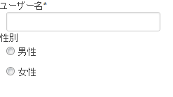

FuelPHPで１サイトを作ってみて気が付いた点など
============================================

[FuelPHP Advent Calendar 2012](http://atnd.org/events/33753)(\#FuelPHPAdvent2012)21日目です。

前日の記事は[@haltcompilerさん](http://tiwtter.com/haltcompiler)の[FuelPHPのormを複数DBに対応させる方法](http://php6.tumblr.com/post/38309122629/fuelphp-advent-calendar-2012)でした。

本日は私が初めてFuelPHPを使った時に、躓いたことの解決法を焦点を絞らずに書いていきたいと思います。

-   fieldsetでform出力したいけど見た目は場所によって変更したい
    ----------------------------------------------------------

    fieldsetでフィールドの定義をまとめて、表示はViewで自在に配置したい。  
     結構あるケースだと思います。

    そんな時はViewで個別にfield単位で表示して、その際にtemplateを設定すれば入力欄のみだったりエラーメッセージのみを取得できます。

    ~~~~ {.brush: .php; .title: .; .notranslate title=""}
    <?php
    // fieldset作成(Model側での処理
    $form = \Fieldset::forge();
    $form->add('user_id', 'ユーザー名')
        ->set_type('text')
        ->add_rule('required');
    $form->add('gender', '性別')
        ->set_type('radio')
        ->set_options(array(1 => '男性', 2 => '女性'));

    // 以下、Viewでの表示
    ?>

    <dl>

    <dt>
    <?php echo $form->field('user_id')
        ->set_template('{label}{required}'); // ラベル単体表示 ?>
    </dt>

    <dd>
    <?php echo $form->field('user_id')
        ->set_template('{field}')
        ->set_attribute(array('class' => 'txt_half')); // 入力欄表示 ?>
    <?php echo $form->field('user_id')
        ->set_template('{error_msg}'); // エラーメッセージ ?>
    </dd>

    <dt>
    <?php echo $form->field('gender')
        ->set_template('{label}{required}'); ?>
    </dt>

    <dd>
    <?php echo $form->field('gender')
        ->set_template('{fields} {field} {label}  {fields}'); // 入力欄表示 ?>
    <?php echo $form->field('gender')
        ->set_template('{error_msg}'); // エラーメッセージ ?>
    </dd>
    </dl>
    ~~~~

    こんな感じで出力されます。  
     

    config/form.phpを参考に、使える置換文字列をset\_templateで設定することでその項目の必要な部分のみ描画できます。  
     動的に出力されるタグに属性を追加したい場合はset\_attributeで追加します。

    私は上の記述方法が結構好きなのですが、項目が多くなってきたりするとViewがとても残念なことになってくるのでもっと綺麗に書きたいと思うのがプログラマの性です。  
     そんな時は[advent calendar7日目の@omoonさんの記事](http://blog.omoon.org/20121207/523http://blog.omoon.org/20121207/523)等を参考にしてfieldset自体を拡張するのがお勧めです。

-   phpunitすると文字化ける(windows)
    --------------------------------

    Windows環境下でoil testすると結果が下のように出てきて悩んでました。

    ~~~~ {.brush: .bash; .title: .; .notranslate title=""}
    [30;42m[2KOK (0 tests, 0 assertions)
    [0m[2K
    ~~~~

    これは文字化けというよりはカラー用のエスケープシーケンスがそのまま出ているようで、utf8がどうのとか文字コードを調べてしまうとなかなか解決に辿り着けません。以下を修正してください。

    COREPATH/phpunit.xml 3行目

    ~~~~ {.brush: .xml; .title: .; .notranslate title=""}
    - <phpunit colors="true" stopOnFailure="false" bootstrap="../core/bootstrapphpunit.php">
    + <phpunit colors="false" stopOnFailure="false" bootstrap="../core/bootstrapphpunit.php">
    ~~~~

-   クラスの名前空間はFuelPHPのスタイルに合わせて絶対でなく相対で
    -------------------------------------------------------------

    IDEの自動補完があるのでついついクラス名をルートから完全修飾したくなりますが、これが挙動にも影響を与えるケースがあります。

    [fuelphp.jp | Google グループ　コントローラからのレスポンスのContent-Typeを変更できません](https://groups.google.com/forum/#!topic/fuelphp_jp/JT4QgQqWNjE)

    郷に入っては郷に従えという諺に従いましょう。

    クラス名だけで自動補完をするためのIDE用定義を生成するスクリプトを[@kenji\_sさん](http://twitter.com/kenji_s)が公開してくださっているので、ここはありがたく使用させていただきます。

    [A Day in Serenity @ kenjis | Eclipse で FuelPHP のコード補完を行わせる冴えたやり方](http://d.hatena.ne.jp/Kenji_s/20120123/1327301678)

    Windowsで使用する場合は以下を修正してください。

    関数の41行目

    ~~~~ {.brush: .php; .title: .; .notranslate title=""}
     if (is_array($file))
     {
    - static::generate_class_definition($file, $str . ucfirst(rtrim($dir, '/') . '_'));
    + static::generate_class_definition($file, $str . ucfirst(rtrim($dir, DS) . '_'));
     }
    ~~~~

-   fieldsetの選択項目でauto\_id\_prefixが2重に付く
    -----------------------------------------------

    デフォルトの設定だと'form\_'になっているauto\_id\_prefixの値がradioなどの選択項目で\<label for='form\_form\_xxxxx'\>となるバグに遭遇しました。(v1.4)

    調べてみるとCOREPATH/classes/fieldset/field.phpの以下が原因だったので修正。

    ~~~~ {.brush: .php; .title: .; .notranslate title=""}
    - $buildfield[$form->label($label, $attributes['id'])] = $this->type == 'radio'
    + $buildfield[$form->label($label, $attributes['id'], array('for' => $attributes['id']))] = $this->type == 'radio'
    ~~~~

    そしてpull requestを送っちゃうぞ〜と意気揚々とgithubを確認してみると、そこには既に修正済みのコードが掲載されていました。  
     gitで最新取ってる人には無縁の悩みだったようです。

-   テキストフィールドに0を設定しても空になる
    -----------------------------------------

    タイトルのまんまです。(v1.4)

    Model側

    ~~~~ {.brush: .php; .title: .; .notranslate title=""}
    $form->add('price', '金額')
     ->set_type('text')
     ->set_value('0');
    ~~~~

    View側

    ~~~~ {.brush: .php; .title: .; .notranslate title=""}
    <?php echo $form->field('price'); ?>
    ~~~~

    とやっても空白なテキストフィールドが表示されてしまいました。(v1.4)

    これはCORE/base.phpのarray\_to\_attrという関数内での条件が原因となっていました。  
     案の定、github上では修正されておりましたので修正内容をありがたくマージしました。

    ~~~~ {.brush: .php; .title: .; .notranslate title=""}
    // Ignore empty values (null/false/[empty string])
    - if (empty($value))
    + if ($value === null or $value === false)
    ~~~~

    prefixの件と合わせて本来はgit使って最新版使ってると悩まないことなのかもしれません。  
     ですが私のように公式のzipアーカイブをダウンロードして、これを基に実装を進めるような人がフレームワーク側のバグっぽい現象に遭遇したら最初にgithubで最新のソースを確認してみることをお勧めします。

-   別DBのテーブルをModel\_Crudで参照する
    -------------------------------------

    APPPATH/config/db.phpに複数の接続情報を用意すると、Model別に使用する設定を変えることが出来ます。

    まずは接続情報をconfigに追加します。

    APPPATH/config/db.php

    ~~~~ {.brush: .php; .title: .; .notranslate title=""}
    return array(
        'active' => 'default',

        'default' => array(
            'connection'  => array(
                'dsn'        => 'mysql:host=db_server;dbname=db',
                'username'   => 'xxxxxxxx',
                'password'   => 'xxxxxxxx',
            ),
        ),

    +   'server2_db' => array(
    +       'connection'  => array(
    +           'dsn'        => 'mysql:host=db_server2;dbname=db',
    +           'username'   => 'xxxxxxxx',
    +           'password'   => 'xxxxxxxx',
    +       )
    +   ),

    );
    ~~~~

    APPPATH/config/各種ステージ/db.php

    ~~~~ {.brush: .php; .title: .; .notranslate title=""}
    return array(
        'active' => 'default',

        /**
         * Base config, just need to set the DSN, username and password in env. config.
         */
        'default' => array(
            'type'        => 'pdo',
            'connection'  => array(
                'persistent' => false,
            ),
            'identifier'   => '`',
            'table_prefix' => '',
            'charset'      => 'utf8',
            'enable_cache' => true,
            'profiling'    => false,
        ),

    +   'server2_db' => array(
    +       'type'        => 'pdo',
    +       'connection'  => array(
    +           'persistent' => false,
    +       ),
    +       'identifier'   => '`',
    +       'table_prefix' => '',
    +       'charset'      => 'utf8',
    +       'enable_cache' => true,
    +       'profiling'    => false,
    +   ),
    ~~~~

    後はModel\_Crud側で$\_connectionプロパティを設定します。

    ~~~~ {.brush: .php; .title: .; .notranslate title=""}
    class Model_Xxxxx extends Model_Crud
    {
        // config/db.phpの連想配列のキーを設定する
    +   protected static $_connection = 'server2_db';
    ~~~~

    これで設定完了です。  
     $\_connectionを省略した際はactiveで示された設定が使用されます。

以上、他の日の記事と微妙に被ってる内容の多い21日目でした。

明日は[@ts\_asanoさん](http://twitter.com/ts_asano)の「(仮)QueryBuilderで小難しいSELECT文を書くためのノウハウ」です。  
 表題からして素敵ですね。お楽しみに♪

