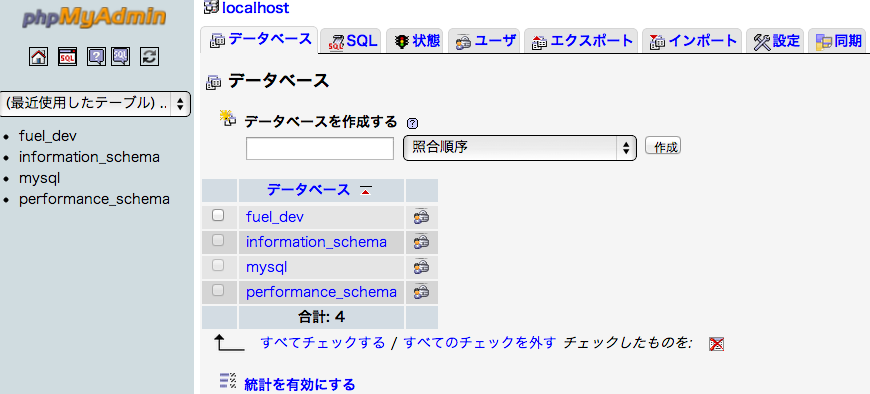
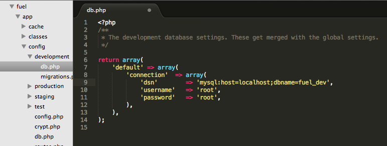
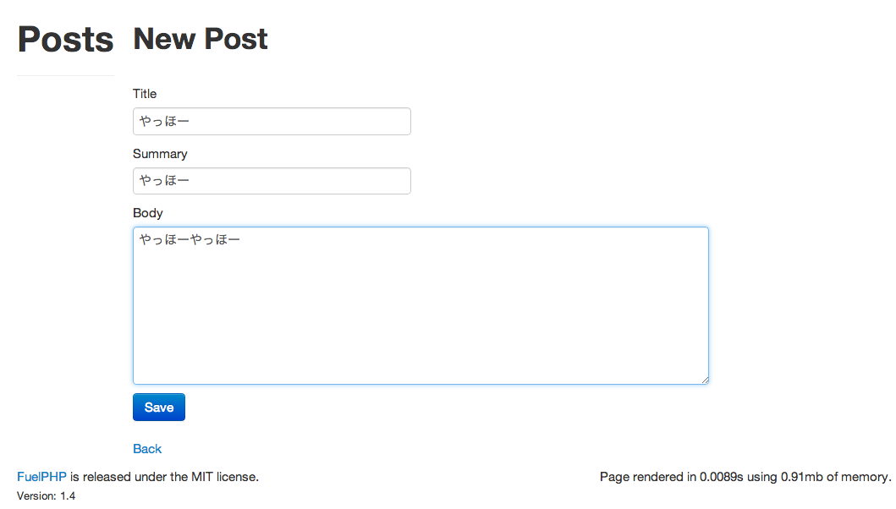
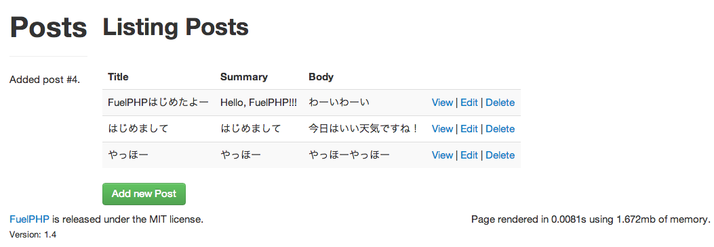
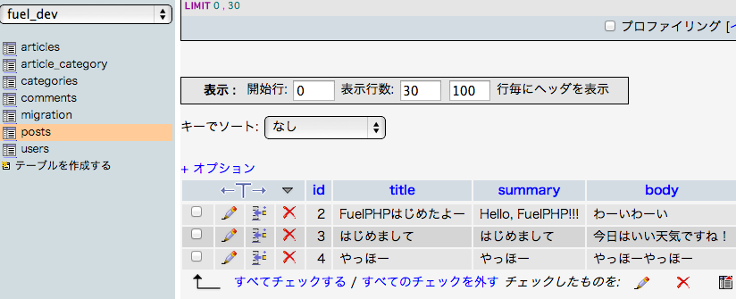

# FuelPHPで簡単なWebアプリケーションを作ってみる
--------------------------------------------------------------------

[FuelPHP AdventCalendar 2012](http://atnd.org/events/33753)の記事です。 昨日は[@mukaken](https://twitter.com/mukaken)さんの [FuelPHP vs Codeigniter](http://d.hatena.ne.jp/mukaken/20121223/1356256954)でした。

FuelPHPを使って簡単なアプリケーションを動かす方法をこの記事では紹介したいと思います、

PHPやFuelPHPがわからない人でも、以下の手順に沿って作成して頂ければ、 手元のPCでアプリケーションを動かすことが出来ると思います。

まずは環境設定からです。

必要な環境
----------

-   MacOSX Lion(10.7.4)
-   エディタ(SublimeText2など)
-   MAMP(Apache, PHP, MySQL)
-   FuelPHP 1.4

## Sublime Text2インストール

普段使ってるエディタがある人はそれを使ってください。 今回はSublime Text2を使ってファイルを編集しました。

[Sublime Text2](http://www.sublimetext.com/)

## MAMPインストール

ここからインストールしてください！

[MAMPダウンロード](http://www.mamp.info/en/index.html)

MAMPのphpを使用するための設定

    # ~/.bash_profile または ~/.zshrc をエディタで開いて入力してください。
    export PATH="/Applications/MAMP/bin/php/php5.3.14/bin:$PATH"

    # 設定を反映
    /Users/kurotaky/lang/php% source ~/.zshrc

## FuelPHPをインストール

こちらを参考にしてインストールしました。

-   [FuelPHP](http://fuelphp.com/)
-   [FuelPHP日本語ドキュメント](http://press.nekoget.com/fuelphp_doc/)

        # oil インストール
         curl get.fuelphp.com/oil | sh

        # oil create [アプリケーション名] でアプリケーションを作成
         /Users/kurotaky/lang/php% oil create blog

         # ↓ コマンドを実行すると以下の様なメッセージが出るはず、少し時間がかかります
         Cloning into './blog'...
         remote: Counting objects: 14502, done.
         remote: Compressing objects: 100% (5019/5019), done.
         remote: Total 14502 (delta 9862), reused 13643 (delta 9246)
         Receiving objects: 100% (14502/14502), 2.21 MiB | 183 KiB/s, done.

        # シンボリックリンク作成
         cd /Applications/MAMP/htdoc
         ln -s ~/lang/php/blog/public blog

これで準備ができました。(MAMPは起動しておいてください！) 以下にアクセスするとFuelPHPのページが表示されるはずです。

http://localhost:8888/blog

## scaffoldを使って簡単なブログっぽいアプリを作ってみる

    oil generate scaffold post title:string summary:varchar[250] body:text

これだけでok

### oil を実行しようとして以下のエラーが出た場合

    /Applications/MAMP/htdocs/blog% oil
    This is not a valid Fuel installation so Oil is a bit lost.
    http://fuelphp.com/docs/installation/instructions.html

    # コマンドはパスが通っているところでここで叩かないとダメ
    著者の環境では User/kurotaky/lang/php/blog に移動して実行すればOK

### あるいは、こんなエラーが出た場合

    /Users/kurotaky/lang/php/blog% oil generate scaffold post title:string summary:varchar[250] body:text
    zsh: no matches found: summary:varchar[250]

    # zsh の場合エスケープが必要らしい
    # [ の前に \を書いてエスケープして実行
    /Users/kurotaky/lang/php/blog% oil generate scaffold post title:string summary:varchar\[250] body:text
    Creating migration: /Users/kurotaky/lang/php/blog/fuel/app/migrations/001_create_posts.php
    Creating model: /Users/kurotaky/lang/php/blog/fuel/app/classes/model/post.php
    Creating controller: /Users/kurotaky/lang/php/blog/fuel/app/classes/controller/post.php
    Creating view: /Users/kurotaky/lang/php/blog/fuel/app/views/post/index.php
    Creating view: /Users/kurotaky/lang/php/blog/fuel/app/views/post/view.php
    Creating view: /Users/kurotaky/lang/php/blog/fuel/app/views/post/create.php
    Creating view: /Users/kurotaky/lang/php/blog/fuel/app/views/post/edit.php
    Creating view: /Users/kurotaky/lang/php/blog/fuel/app/views/post/_form.php
    Creating view: /Users/kurotaky/lang/php/blog/fuel/app/views/template.php

    # マイグレーションの実行
    /Users/kurotaky/lang/php/blog% oil refine migrate
    001_create_posts

    # phpMyAdminであらかじめテーブルを作っていないと例外が出るかも。

http://localhost:8888/MAMP/?language=Japanese の phpMyAdminからデータベースを選択して、 データベースを作成してください。(ここではfuel\_devとしています)

データベース作成後、config/development/db.php の dsnの値を設定してください。 データベース名をfuel*devとした場合は、dbname=fuel*devとしてください。

たったこれだけで記事を作成・読み取り・更新・削除が出来る簡単なブログっぽいアプリの完成です！ アクセスして確認してみましょう。

http://localhost:8888/blog/post

記事を投稿できます。

投稿した記事の一覧が確認できます。

データベースにも反映されていますね。

## さらに詳しく

現在、以下の書籍を読んでいますがFuelPHPの特徴を理解するだけでなく、 MVCモデルの基本的な説明やOSごとの環境設定、ユニットテストの方法なども書かれているので、 ぜひまだ以下の本を持っていないかたは手にとって読んでみてください！

-   [はじめてのフレームワークとしてのFuelPHP](http://tatsu-zine.com/books/fuelphp1st)

## 日本語ドキュメント翻訳募集をしているようです。

有志の方たちが翻訳作業を進めているようです。

-   [https://github.com/NEKOGET/FuelPHP\_docs\_jp](https://github.com/NEKOGET/FuelPHP_docs_jp)
-   [FuelPHPドキュメント翻訳へのお誘い](http://pneskin2.nekoget.com/press/?p=1044)

自分も少しずつ出来るところはコミットしていきたいと思います。

## 参考にしたサイト

-   [http://d.hatena.ne.jp/Kenji\_s/20111109/1320827056](http://d.hatena.ne.jp/Kenji_s/20111109/1320827056)
-   [http://net.tutsplus.com/tutorials/php/getting-started-with-the-fuel-php-framework/](http://net.tutsplus.com/tutorials/php/getting-started-with-the-fuel-php-framework/)
-   [http://press.nekoget.com/fuelphp\_doc/](http://press.nekoget.com/fuelphp_doc/)

明日は[@tukimikage](https://twitter.com/Tukimikage) さんです。 お楽しみに！
